```{r setup, include=FALSE, message=FALSE}
library(tidyverse)
library(janitor)
library(corrr)
library(broom)
library(haven)
# library(ggdag)
library(rlang)
library(skimr)
library(compareGroups)
library(knitr)
library(kableExtra)
library(qvalue)
# library(survival)
# library(survminer)
# library(epiR)

set.seed(33)

knitr::opts_chunk$set(echo = TRUE,message=FALSE,warning=FALSE, error=FALSE)
theme_set(theme_bw())

options(htmltools.dir.version = FALSE)

aidsdb <- read_dta("data-raw/aidsdb.dta") %>% as_factor() %>% 
  mutate_if(.predicate = is.factor,.funs = fct_relevel,... = "No")
espir <- read_dta("data-raw/espirometria.dta") %>% as_factor()
multpv <- read_rds("data-raw/createpval.rds")
```

# Temario

1. __(breve) Introduction a R__

  * Conceptos clave

2. __Variables:__ 

  * Concepto y clasificación
  * Explorar distribuciones
  * __Prueba de Hipótesis:__ limitantes y alternativas

5. __Modelos lineales:__ 

  * __Regresión lineal y logística__
  * Relación con PH
  * __Comparación múltiple:__ corrección del valor p y FDR
  * Aplicación en _microarrays_

---

# Metodología

- Teórico y __práctico__

--

  * Definiciones
  * Responder a _¿y cómo lo hago en R?_

--

- Estructura:
  
  1. Evaluación
  
  2. Teoría
  
  3. Práctica
  
  4. Resolución
  
  5. Evaluación

--

- Contenido disponible en __https://github.com/avallecam/biostat2019__

---

class: center, middle

# ¡Pregunta 1!

## Del 1 al 5, ¿Qué tan familiarizado estás con cada tema?

---
class: inverse, center, middle

# (breve) introducción a R

---

class: center, middle

__Ir a__ 

__`01-biostat2019-slides.pdf`__


---

# Práctica 1

```{r,eval=FALSE}
#aritmética
2+2
x <- 2
x+2

#funciones
seq(1,10)
rep(1,5)

#vectores
heights <- c(147.2, 153.5, 152.5, 162.0, 153.9)
mean(heights)

#subconjuntos
y <- LETTERS[1:10]
y[3:7]
```

Si necesitas ayuda:
  1. Pregúntale a R con la función `help()` o `?`, p.e.: `help(mean)` o `?mean`
  2. Nos pasas la voz :)

---
class: inverse, center, middle

# Variables

<!--
- Enfatizar en los supuestos
- Probabilidades, distribución normal, definición del estadístico z, valor p, 
- ¿teorema del límite central? -> error estandar -> intervalo de confianza
- distribución T student
-->

---

# Variables numéricas

```{r,out.width = '50%'}
espir %>% 
  select(edad,vef,talla) %>% 
  skim_to_wide() %>% 
  kable(format = "html") %>% 
  kable_styling(full_width = F,font_size = 15)
```

---

# Variables numéricas: PH

.pull-left[

```{r,fig.height=4,fig.width=4}
espir %>% 
  ggplot(aes(x = talla,y = vef)) +
  geom_point() +
  geom_smooth(method = "lm")
```

]

.pull-right[

```{r,fig.height=4,fig.width=4}
espir %>% 
  select(edad,vef,talla) %>% 
  correlate() %>% 
  rearrange() %>% 
  shave()
```

]

---

# Variables categóricas

```{r}
espir %>% 
  tabyl(sexo) %>% 
  adorn_totals("row") %>% 
  adorn_pct_formatting()

espir %>% 
  tabyl(sexo,fumar) %>% 
  adorn_totals(c("col")) %>% 
  adorn_percentages() %>% 
  adorn_pct_formatting() %>% 
  adorn_ns(position = "front") %>% 
  adorn_title()
```

---

# Variables categóricas: PH

```{r}
espir %>% 
  tabyl(sexo,fumar) %>% 
  chisq.test() %>% 
  tidy()
```

---

# Variables numéricas y categóricas

.pull-left[

```{r,fig.height=4,fig.width=4}
espir %>% 
  ggplot(aes(x = fumar,y = vef)) +
  geom_point(aes(color=fumar),position = position_jitter()) +
  geom_boxplot(alpha=0)
```

]

.pull-right[

```{r,fig.height=4,fig.width=4}
espir %>% 
  ggplot(aes(x = fumar,y = vef)) +
  geom_violin(aes(color=fumar))
```

]

---

# Variables numéricas y categóricas: PH

```{r}
espir %>% 
  select(fumar,vef) %>% 
  group_by(fumar) %>% 
  skim_to_wide() %>% 
  kable(format = "html") %>% 
  kable_styling(full_width = F,font_size = 15)
```

```{r}
t.test(vef ~ fumar, data = espir,var.equal=FALSE) %>% 
  tidy()
```

---

# Práctica 2

```{r,eval=FALSE}
#importar base en formato DTA
espir <- read_dta("data-raw/espirometria.dta") %>% as_factor()

#generar resumen descriptivo
espir %>% skim()

#grafica distribución
espir %>% 
  ggplot(aes(vef)) +
  geom_histogram()

#realizar pruebas de hipótesis
compareGroups(formula = fumar ~ edad + vef + talla + sexo,
              data = espir, byrow=T#,method=c(vef=2)
              ) %>% 
  createTable(show.all = T) #%>% export2xls("table/tab1.xls")
```

```{r,eval=FALSE,echo=FALSE}

espir %>% 
  select(edad,vef,talla) %>% 
  correlate() %>% 
  stretch()

espir %>% 
  select(edad,vef,talla) %>% 
  as.matrix() %>% 
  Hmisc::rcorr() %>% 
  broom::tidy()
```

```{r,eval=FALSE,echo=FALSE}
#regresar luego de finalizado el capítulo de regresiones
t.test(vef ~ fumar, data = espir,var.equal=TRUE) %>% 
  tidy()
lm(vef ~ 1+ fumar, data = espir) %>% tidy()
lm(vef ~ 1+ fumar, data = espir) %>% confint_tidy()
```

---

# Comentario: Pruebas de hipótesis

- __Limitante:__ 
  - dicotomización de resultados en significativos y no significativos
  - valor p da indicativo de _tamaño de efecto_, pero no lo cuantifica

- __Alternativa<sup>1</sup>:__

```{r, echo=FALSE, fig.cap="", out.width = '100%'}
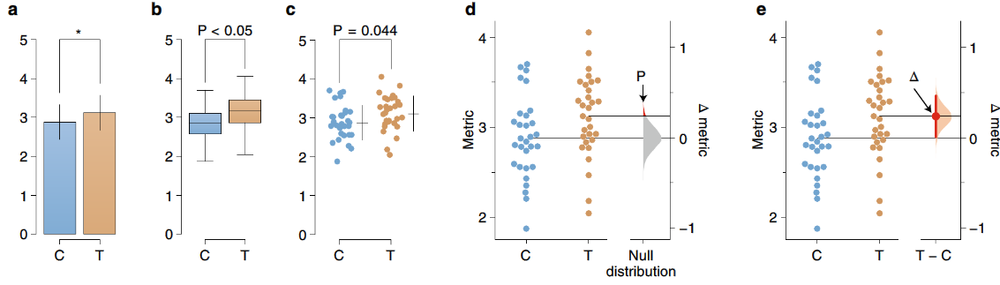
```

.footnote[
[1] [Moving beyond P values: data analysis with estimation graphics](https://www.nature.com/articles/s41592-019-0470-3.epdf?author_access_token=Euy6APITxsYA3huBKOFBvNRgN0jAjWel9jnR3ZoTv0Pr6zJiJ3AA5aH4989gOJS_dajtNr1Wt17D0fh-t4GFcvqwMYN03qb8C33na_UrCUcGrt-Z0J9aPL6TPSbOxIC-pbHWKUDo2XsUOr3hQmlRew%3D%3D)
]

---
class: inverse, center, middle

# Modelos lineales


---

# ¿**Por qué** usar una **regresión**?

--

```{r, echo=FALSE, fig.cap="", out.width = '90%',fig.align='center'}
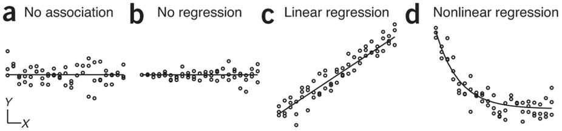
```

--


- Porque:

  - Fija una **variable independiente** o **exposición** y observa una respuesta en la **variable dependiente** o **desenlace**.

  - Permite **explicar** el cambio promedio de un evento $Y$ en base a cambios en $X$, usando coeficientes o medidas de asociación.

  - Permite **predecir** la probabilidad asociada a un evento.
  
  - Permite **cuantificar** el tamaño del efecto de la comparación.


---

# Regresión Lineal Simple

.pull-left[

## características

- **una** variable independiente (simple)
- **una** variable dependiente (univariada)
- ambas variables deben ser **numéricas**

## objetivos

- ajustar datos a una recta
- interpretar medida de bondad de ajuste ( $R^2$ ) y coeficientes
- evaluar supuestos
- visualizar el modelo


]


.pull-right[

```{r, echo=FALSE,fig.height=4,fig.width=3}
women %>% ggplot(aes(weight,height)) + geom_point() + geom_smooth(method = "lm")
```

$$Y = \beta_0 + \beta_1 X_1 + \epsilon$$

]

---

# RLinS: Ejemplo 

- __Evaluación de supuestos:__

  + **#1** independencia de observaciones
  
  + **#2** linealidad

```{r,fig.height=3,fig.width=3}
espir %>% 
  ggplot(aes(edad,vef)) +
  geom_point()
```


---

# RLinS: residuales

- Definición: Diferencia entre el _valor observado_ y el _valor predicho_ en el eje vertical.

.pull-left[

```{r, echo=FALSE, fig.cap="", out.width = '50%'}
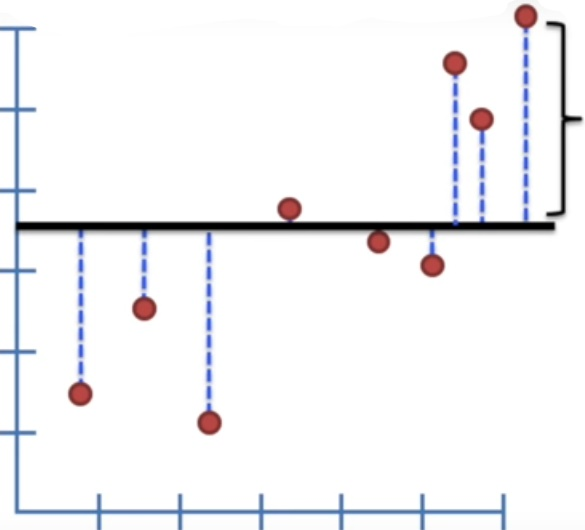
```

```{r, echo=FALSE, fig.cap="", out.width = '50%'}
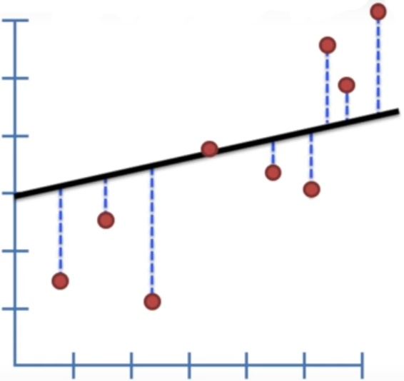
```

]

.pull-right[

```{r, echo=FALSE, fig.cap="", out.width = '50%'}

```

```{r, echo=FALSE, fig.cap="", out.width = '50%'}
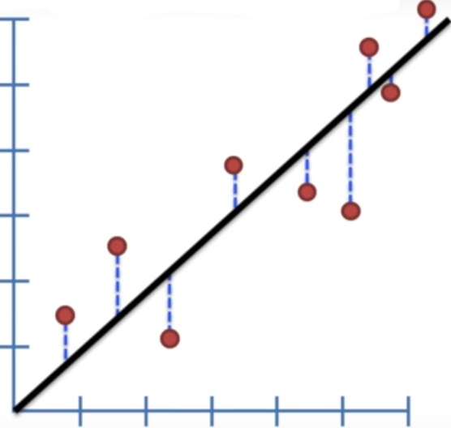
```

]

---

# RLinS: suma de mínimos cuadrados

.pull-left[

<!---->

```{r, echo=FALSE, fig.cap="", out.width = '90%'}
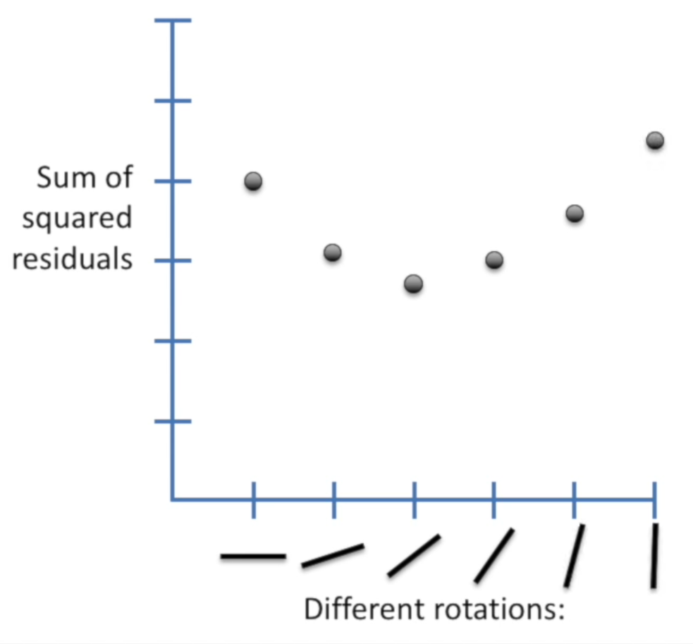
```

]

.pull-right[

Cálculo de la **sumatoria del cuadrado de los residuales** hacia la media y la recta:

$$ SSE(mean) = \sum (data - mean)^2 $$
$$ SSE(fit) = \sum (data - fit)^2 $$

$$ Var(x) = \frac{SSE(x)^2}{n} $$

Medida de **bondad de ajuste**:

$$ R^2 = \frac{Var(mean) - Var(fit)}{Var(mean)}  $$

]

---

# RLinS: bondad de ajuste

```{r}
wm1 <- lm(vef ~ edad, data = espir)
wm1 %>% glance() %>% dplyr::select(r.squared:df)
```

**INTERPRETACIÓN**

- **edad** _explica_ el **57%** de la variabilidad de **VEF**

- existe un **57%** _de reducción en_ la variabilidad de **VEF** al tomar en cuenta la **edad**


---

# RLinS: coeficientes

```{r}
wm1 %>% tidy()
```

- Interpretación:

```{r, echo=FALSE, fig.cap="", out.width = '90%'}
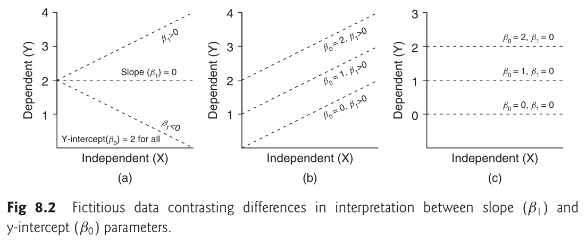
```

---

# RLinS: coeficientes

```{r}
wm1 %>% tidy()
wm1 %>% confint_tidy()
```

- $\beta_{edad}$: 
- En la población, por cada incremento de **edad** en _una unidad_, el **VEF** en promedio _incrementa_ en 0.22 mL/s,
- con un intervalo de confianza al 95% de 0.21 a 0.24 mL/s.
- Este resultado es estadísticamente significativo con un valor **p < 0.001**

---

# RLinS: supuesto **#3** normalidad de residuales

.pull-left[

```{r, echo=FALSE, fig.cap="", out.width = '75%'}

```
]

.pull-right[

```{r, echo=FALSE, fig.cap="", out.width = '100%'}
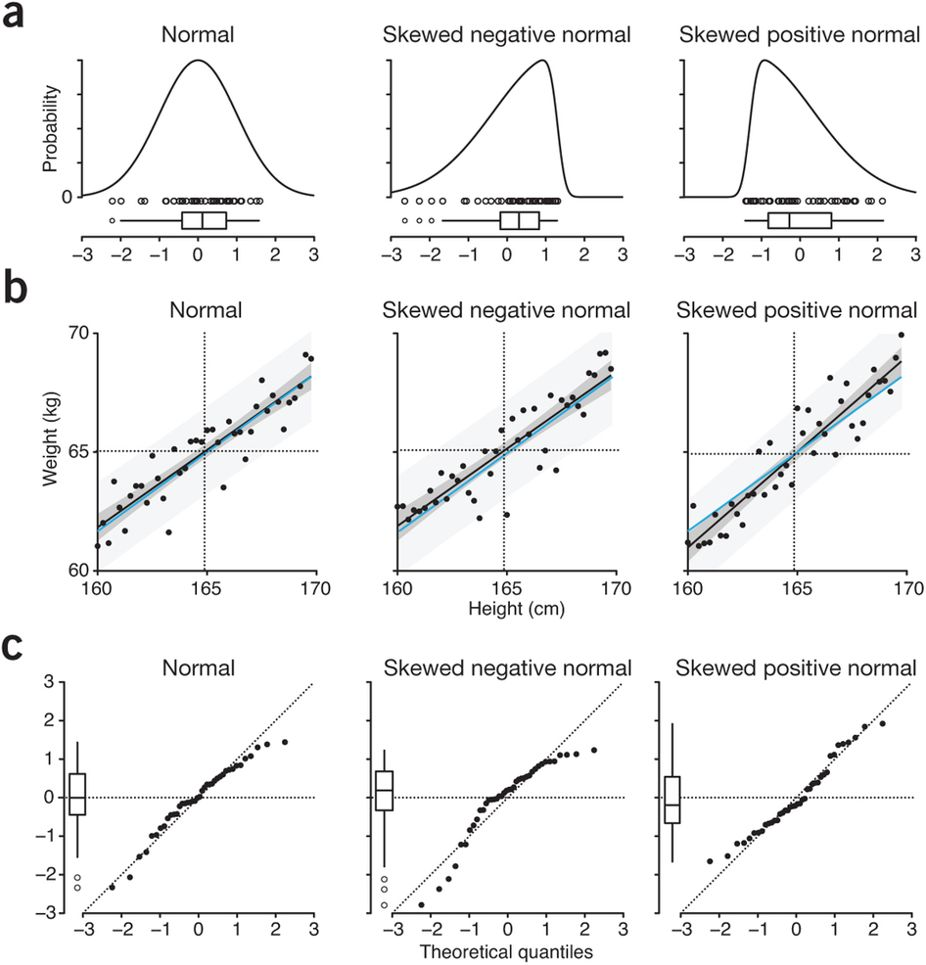
```

]

---

# RLinS: supuesto **#3** normalidad de residuales

.pull-left[

- **META:** todos los puntos sobre la línea

```{r,fig.height=3,fig.width=3}
wm1 %>% 
  augment() %>% 
  ggplot() +
  geom_qq(aes(sample=.std.resid)) + 
  geom_qq_line(aes(sample=.std.resid))
```

]

.pull-right[

```{r,fig.height=3,fig.width=3,eval=TRUE, echo=TRUE}
wm1 %>% augment() %>% 
  ggplot(aes(.std.resid)) +
  geom_histogram()
```

]

---

# RLinS: supuesto **#4** homoscedasticidad


```{r, echo=FALSE, fig.cap="", out.width = '65%'}
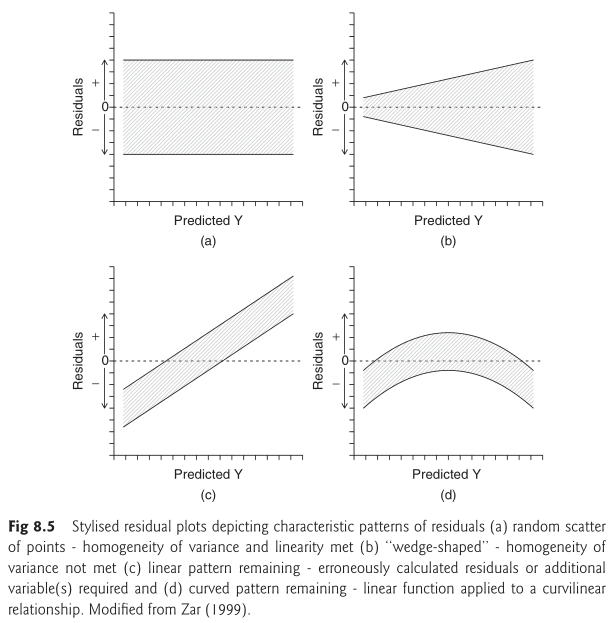
```

---

# RLinS: supuesto **#4** homoscedasticidad

```{r, echo=FALSE, fig.cap="", out.width = '65%'}
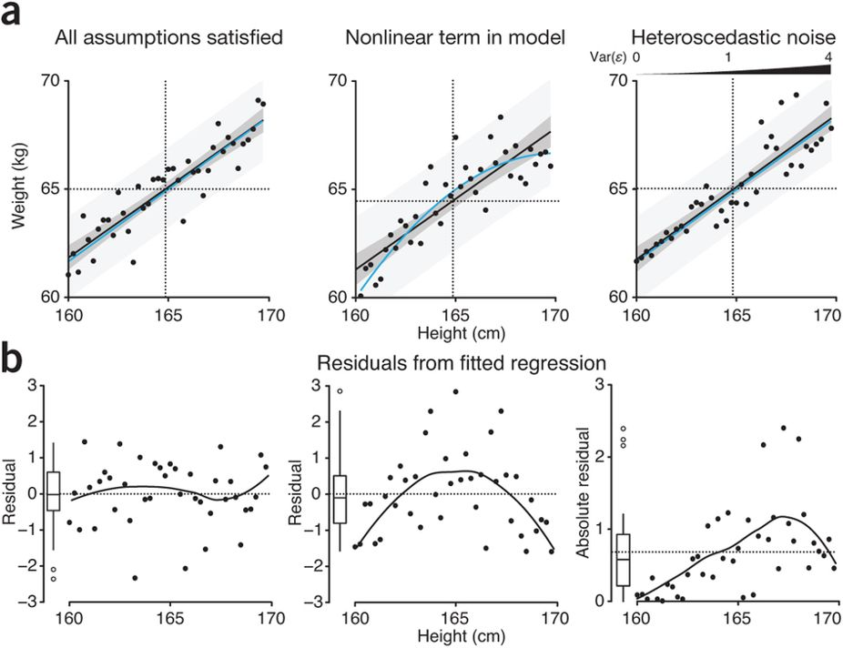
```

---

# RLinS: supuesto **#4** homoscedasticidad

- **META:** distribución idéntica a ambos lados de la línea

```{r,fig.height=3,fig.width=3,message=FALSE,error=FALSE}
wm1 %>% 
  augment() %>% 
  ggplot(aes(.fitted,.std.resid)) +
  geom_point() +
  geom_smooth() +
  geom_hline(yintercept = c(0))
```

---

# RLinS: ¿cómo se ve el modelo?

$$ Y = \beta_0 + \beta_1 X_1 + \epsilon $$
$$ VEF = 0.60 + 0.22 (edad) + \epsilon $$

```{r,fig.height=3,fig.width=3}
espir %>% 
  ggplot(aes(edad,vef)) +
  geom_point() + 
  geom_smooth(method = "lm")
```

<!-- - ¿qué pasa si borramos `method = "lm"`? -->

---

# RLinS: retroalimentación

- $R^2$ indica el porcentaje de _variabilidad_ del desenlace (var. dependiente) explicada por la exposición (var. independiente).

- los **coeficientes** permiten __cuantificar__ el _tamaño del efecto_ de la exposición en el desenlace en base a un modelo estadístico.

- los **supuestos** permiten evaluar qué tan adecuado es el ajuste de los datos al modelo.

---

# Práctica 3

- ajustar una recta

```{r,fig.height=3,fig.width=3,eval=FALSE}
espir %>% 
  ggplot(aes(edad,talla)) +
  geom____()
```

- identificar coeficientes y R^2^

```{r,eval=FALSE}
# recordar: y ~ x
wm1 <- lm(_____ ~ _____, data = _____)
wm1 %>% g_____
wm1 %>% t_____
wm1 %>% c_____
```

- evaluar supuestos: normalidad y homoscedasticidad

```{r,fig.height=3,fig.width=3,eval=FALSE}
wm1 %>% augment() %>% 
  ggplot() + _____

wm1 %>% augment() %>% 
  ggplot(aes(.fitted,.std.resid)) + __________
```


---

# Regresión Logística Simple

.pull-left[

## características

- **una** variable independiente (simple)
- **una** variable dependiente (univariada)
- la variable _dependiente_ debe ser **categórica dicotómica**

## objetivos

- ajustar datos a una recta
- interpretar coeficientes


]


.pull-right[

```{r, echo=FALSE, fig.cap="", out.width = '100%'}
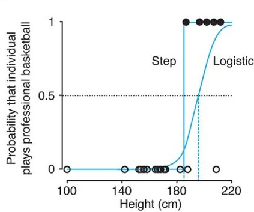
```

$$Y = \beta_0 + \beta_1 X_1 + \epsilon$$

]

---

# RlogS: Ecuación y coeficiente


- $p$ posee distribución _binomial_, linealizada $[-\infty,\infty]$ por la función _logit_

$$logit(p) = log(odds)  = log\left(\frac{p}{1-p}\right) \\ logit(p) = \beta_0 + \beta_1 X_1 + . . . + \beta_n X_n + \epsilon \enspace ; \enspace y \sim Binomial$$

- El valor exponenciado de los coeficientes se pueden interpretar como **Odds Ratio (OR)**

$$Y = \beta_0 + \beta_1 X_1 \\ \begin{cases} Y_{x=1} = log(odds_{x=1}) = \beta_0 + \beta_1(1) \\ Y_{x=0} = log(odds_{x=0}) = \beta_0 + \beta_1(0) \end{cases} \\ Y_{x=1} - Y_{x=0} = \beta_1 \\ log(odds_{x=1}) - log(odds_{x=0}) = \beta_1 \\ log \left(\frac{odds_{x=1}}{odds_{x=0}}\right)  = \beta_1 \\ OR = exp(\beta_1)$$

```{r,fig.height=3,fig.width=6,eval=FALSE,echo=FALSE}
data_frame(p=seq(0,1,0.01)) %>% 
  mutate(odd=p/(1-p),
         logit=log(odd)) %>% 
  pivot_longer(cols = -p,names_to = "key",values_to = "value") %>% 
  mutate(key=fct_rev(key)) %>% 
  ggplot(aes(p,value)) +
  geom_point() +
  facet_wrap(~key,scales = "free") +
  coord_flip()
```

---

# RlogS: Modelos Lineales Generalizados

GLM ajusta modelos lineales de $g(y)$ con covaribles $x$

$$g(Y) = \beta_0 + \sum_{n=1}^{n} \beta_n X_n \enspace , \enspace y \sim F$$

Donde: 

- $F$ es la familia de distribución
- $g(\space)$ es la función de enlace

```{r, echo=FALSE, fig.cap="", out.width = '90%'}
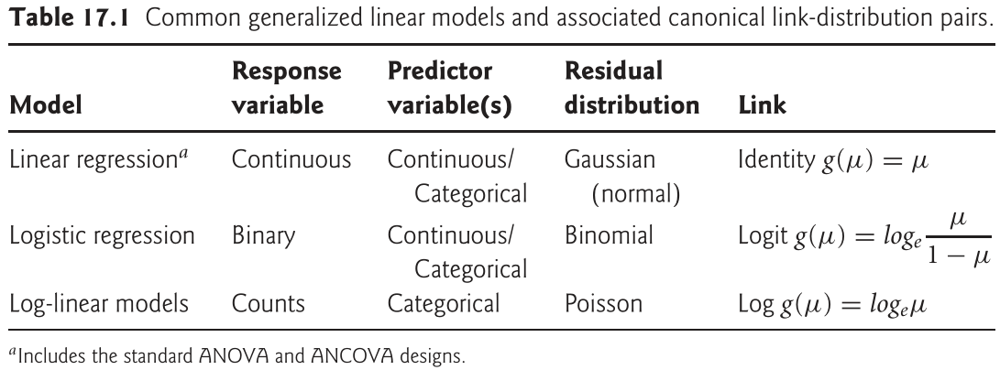
```


---

# GLM: máxima verosimilitud

.pull-left[

```{r, echo=FALSE, fig.cap="", out.width = '75%',fig.align='center'}
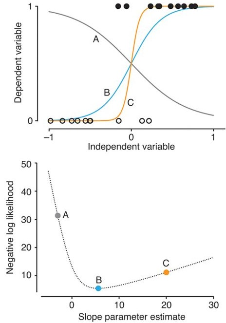
```

]

.pull-right[

- La estimación de parámetros se da por un proceso de optimización llamado **máxima verosimilitud** (o _likelihood_).

- un estimado por _máxima verosimilitud_ es aquel que maximiza la verosimilitud de obtener las actuales observaciones dado el modelo elegido.

- estimación numérica mediante _proceso iterativo_ hasta la convergencia.


]

---

# RlogS: Ejemplo

**En personas VIH+, ¿el polimorfismo CCR5 está *asociado* con el desarrollo del SIDA?**

- base: `aidsdb.dta`
- exposición: `ccr5`
- desenlace: `aids`

```{r,echo=FALSE}
knitr::kable(head(aidsdb), format = 'html')
```

---

# RlogS: Interpretar variables categóricas 

```{r}
wm1 <- glm(aids ~ ccr5, data = aidsdb, family = binomial(link = "logit"))
```

```{r,echo=FALSE}
#wm1 %>% glance()
m1 <- avallecam::epi_tidymodel_or(wm1) %>% print()
```

- $\beta_0$
  - En la población, el **odds** de tener sida dado que **no poseen CCR5** es **`r round(m1$or[1],2)`**,
  - con un intervalo de confianza al 95% de `r round(m1$conf.low[1],2)` a `r round(m1$conf.high[1],2)`.

- $\beta_{CCR2:Yes}$
  - En la población, el **odds** de tener sida dado que **sí poseen CCR5** es
  - **`r round(m1$or[2],2)`** veces, 
  - el **odds** de tener depresión dado que **no poseen CCR5**,
  - con un intervalo de confianza al 95% de `r round(m1$conf.low[2],2)` a `r round(m1$conf.high[2],2)`.
  - Este resultado no es estadísticamente significativo con un valor **p = `r round(m1$p.value[2],3)`**

```{r,fig.height=3,fig.width=3, echo=FALSE, eval=FALSE}
#fitted values, residuals, etc
wm1 %>% augment()
```

---

# RlogS: Interpretar variables contínuas 

```{r}
wm1 <- glm(aids ~ loghivrna, data = aidsdb, family = binomial(link = "logit"))
```

```{r,echo=FALSE}
#wm1 %>% glance()
m1 <- avallecam::epi_tidymodel_or(wm1) %>% print()
```

- $\beta_{loghivrna}$
  - En la población, por cada incremento en una unidad del **log de RNA viral**,
  - el **odds** de sida _cambia_ en **`r round(m1$or[2],2)`**, con un intervalo de confianza al 95% de `r round(m1$conf.low[2],2)` a `r round(m1$conf.high[2],2)`.
  - Este resultado es estadísticamente significativo con un valor **p < 0.001**
 
```{r,fig.height=3,fig.width=3, echo=FALSE, eval=FALSE}
#fitted values, residuals, etc
wm1 %>% augment()
```

---

# Práctica 4

- **¿Qué otros marcadores están asociados con el desarrollo de SIDA?**

- **Intenta ajustar por otras covariables como edad, raza o sexo**

```{r,eval=FALSE}
# recordar: y ~ x
wm1 <- glm(_____ ~ _____ + _____, data = _____, family = _____(link = "_____"))
wm1 %>% g_____
wm1 %>% t_____
wm1 %>% c_____
wm1 %>% avallecam::epi_tidymodel_or()
```

---

# Relación con Prueba de Hipótesis

```{r, echo=FALSE, fig.cap="", out.width = '100%',fig.align='center'}
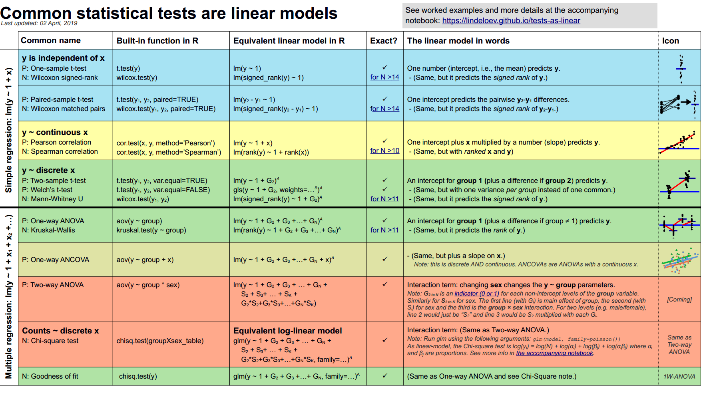
```

.footnote[
[1] [Jonas Kristoffer Lindeløv](https://lindeloev.github.io/tests-as-linear/)
]

---
class: inverse, center, middle

# Comparaciones múltiples


---

# Problema

- En inglés: _multiple hypothesis testing_
- Cuando monitoreamos un gran número de resultados experimentales (p.e.: experimentos ómicos), esperamos observar descubrimientos que ocurren al azar.
- Los métodos desarrollados para ajustar o reinterpretar los valores p son llamados _métodos de corrección por múltiples comparaciones_.


```{r, echo=FALSE, fig.cap="", out.width = '75%',fig.align='center'}
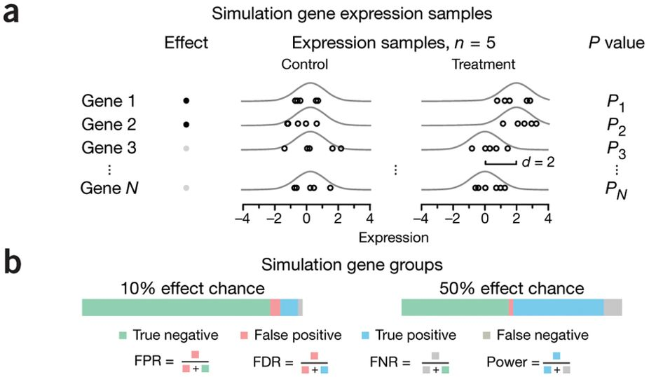
```

---

# Método Benjamini Hochberg

- __proceso algorítmico__
  - ordenar ascendentemente valores p
  - rankear valores p
  - el mayor valor p tiene el mismo valor de p ajustado
  - el siguiente es el menor entre 
    * el p ajustado previo, o
    * la siguiente solución
    
    $$p_{adjusted} = p_{value} * \left(\frac{N_{p_{value}}}{rank_{p_{value}}}\right)$$

```{r}
tibble(p=seq(0.01,0.91,0.1),
       r=1:10) %>% 
  mutate(p.adjust=p.adjust(p = p,method = "BH"))
```

---

# Ejemplo: método BH

```{r,fig.height=6,fig.width=6}
multpv %>% 
  ggplot(aes(p.value#,fill=oracle
             )) + 
  geom_histogram(binwidth=.05) +
  facet_wrap(~ type, scale="free_y", nrow=2) +
  xlab("P-values")
```

---

# Ejemplo: método BH

```{r}
multpv %>% 
  group_by(type) %>% 
  mutate(p.adjust=p.adjust(p = p.value,method = "BH"),
         p.adjust_pass=if_else(p.adjust<0.05,"TRUE","FALSE")) %>% 
  ungroup() %>% 
  ggplot(aes(p.value,fill=p.adjust_pass)) + 
  geom_histogram(binwidth=.05) +
  facet_wrap(~ type, scale="free_y", nrow=2) +
  labs(x="P-values",fill="BH")
```


---

# Método Storey (q-values)

```{r, echo=FALSE, fig.cap="", out.width = '75%',fig.align='center'}
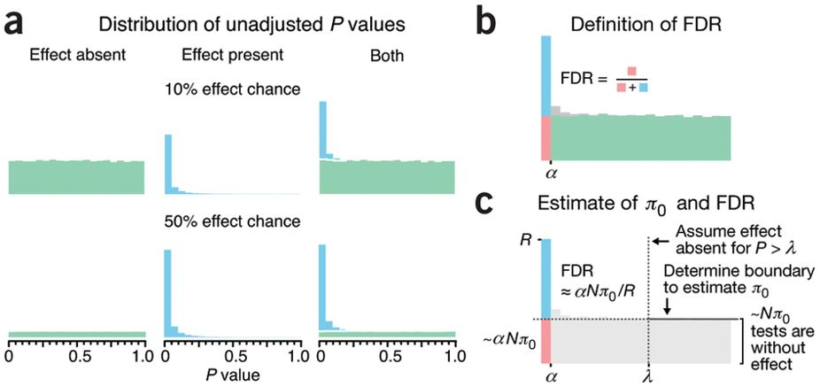
```

---

# Aplicación: Microarray

```{r}
cleaned_data <- read_rds("data-raw/microarraydata.rds")

plot_expression_data <- function(expression_data) {
  ggplot(expression_data, aes(rate, expression, color = nutrient)) +
    geom_point() +
    geom_smooth(method = "lm", se = FALSE) +
    facet_wrap(~name + systematic_name, scales = "free_y")
}

# visualization -----------------------------------------------------------

cleaned_data %>%
  filter(BP == "leucine biosynthesis") %>%
  plot_expression_data()

cleaned_data %>%
  filter(BP == "cell wall organization and biogenesis") %>%
  plot_expression_data()

# single regression -------------------------------------------------------

LEU1_leucine <- cleaned_data %>%
  filter(name == "LEU1", nutrient == "Leucine")

ggplot(LEU1_leucine, aes(rate, expression)) +
  geom_point()

mod <- lm(expression ~ rate, LEU1_leucine)
summary(mod)

tidy(mod)

# to all combination of gene and nutrient ---------------------------------

cleaned_data %>% count(nutrient)

#reducimos la base para reducir el tiempo de ejecución
linear_models <- cleaned_data %>%
  filter(nutrient=="Ammonia") %>% 
  group_by(name, systematic_name, nutrient) %>%
  nest() %>% 
  mutate(model = map(data, ~ lm(expression ~ rate, data = .x)),
         tidym = map(model,tidy))

slope_terms <- linear_models %>% 
  unnest(cols = c(tidym)) %>% 
  ungroup() %>% 
  filter(term=="rate" & !is.na(p.value)) 

slope_terms %>% 
  ggplot(aes(p.value)) +
  geom_histogram(binwidth = .05) +
  facet_wrap(~nutrient)

slope_terms_adj <- slope_terms %>% 
  mutate(q.value = qvalue(p.value)$qvalues,
         q.value_pass=if_else(q.value < .01,"TRUE","FALSE")) 

slope_terms_adj %>% 
  ggplot(aes(p.value,fill=q.value_pass)) +
  geom_histogram(binwidth = .05) +
  facet_wrap(~nutrient)

slope_terms_adj %>% 
  filter(q.value_pass=="TRUE") %>% 
  arrange(q.value)
```


---

# Práctica 5

- explorar la documentación del paquete `qvalue` [link](https://github.com/StoreyLab/qvalue)

```{r,eval=FALSE}
library(qvalue)

#ejemplo 1
q <- qvalue(p = p)
summary(q)
hist(q)
plot(q)

#ejemplo 2
data(hedenfalk)
pvalues <- hedenfalk$p
qobj <- qvalue(p = pvalues)
summary(qobj)
hist(qobj)
plot(qobj)

#datos microarray
qmicro <- qvalue(p = slope_terms$p.value)
summary(qmicro)
hist(qmicro)
plot(qmicro)
```


---

# Referencias

- Logan, M. (2011). Biostatistical design and analysis using R: a practical guide. John Wiley & Sons.
- Rstudio Education. (2019). `https://education.rstudio.com/`
- Akehurst H. (2016) Bioestadística con R.
- Statistics for Biologist: Points of Significance. Link: `https://www.nature.com/collections/qghhqm/pointsofsignificance`
- Ding J, et al. (2018). Association of gene polymorphism of SDF1(CXCR12) with susceptibility to HIV-1 infection and AIDS disease progression: A meta-analysis. PLoS One. `https://www.ncbi.nlm.nih.gov/pubmed/29420545`
- Estrada-Aguirre JA, et al. (2013). Protective effect of CCR5 Delta-32 allele against HIV-1 in Mexican women. Curr HIV Res. `https://www.ncbi.nlm.nih.gov/pubmed/24382026`
- Robinson D. (2014). Modeling gene expression with broom: a case study in tidy analysis. http://varianceexplained.org/r/tidy-genomics-broom/
